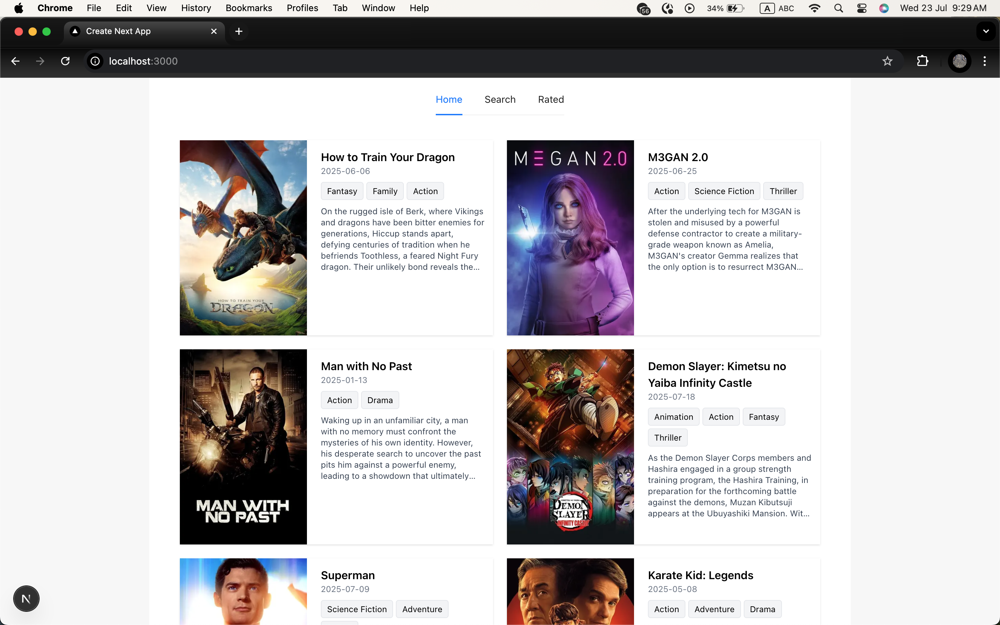
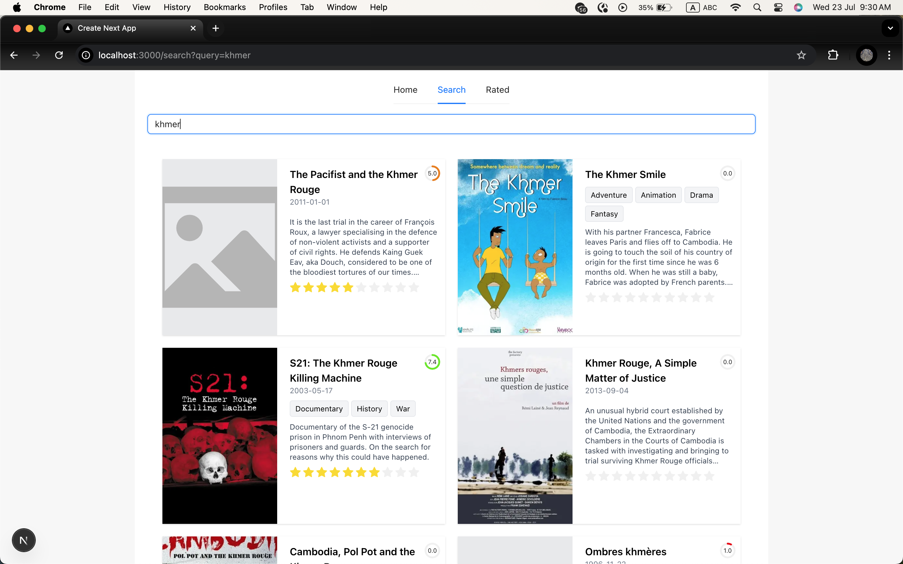
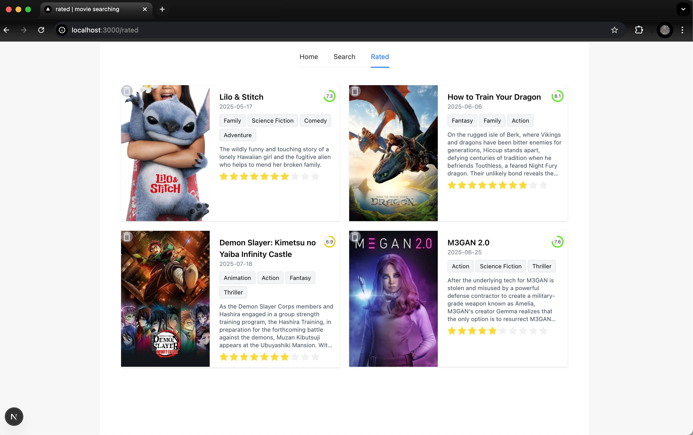

# 🎬 MovieDB Search App

A movie search and rating web application built using **Next.js 15**, **TypeScript**, and **Ant Design**, powered by [The Movie Database (TMDB) API](https://developer.themoviedb.org/).

🌐 Live demo: [https://next-moviedb-search.vercel.app](https://next-moviedb-search.vercel.app)

---

## Features

- 🔎 **Search Movies** by keyword with instant result and server-side pagination
- ⭐ **Rate Movies** with 0.5 to 10 stars using a guest session and update star anable
- ❤️ **Rated Tab** to view all rated movies and remove rated
- 🎨 **Color-coded rating display** using circular progress indicators
- 🧠 **Genre Tags** rendered from genre IDs via API
- ⚙️ **Responsive Design** for both desktop and mobile
- ⚡ **Debounced Search** input for better performance

---

## 🚀 Tech Stack

- **Framework**: [Next.js 15](https://nextjs.org/)
- **Language**: TypeScript
- **UI Library**: [Ant Design (antd)](https://ant.design/)
- **HTTP Hook**: [SWR](https://swr.vercel.app/)
- **API**: [The Movie Database (TMDB)](https://developer.themoviedb.org/)
- **ANIMATION**: [Motion](https://motion.dev/)
- **Utils**: Lodash, Prettier, ESLint, Husky

---

## 🏁 Getting Started

### 1. Clone the project

```bash
git clone https://github.com/Dulkh91/next-moviedb-search.git
cd next-moviedb-search
```

### 2. Install dependencies

```bash
npm install
```

### 3. Create .env.local

```js
# .env.local

API_KEY = your_tmdb_api_key
NEXT_PUBLIC_CLIENT_TOKEN_KEY = your_bearer_v4_token
NEXT_PUBLIC_CLIENT_WEB_URL = https://api.themoviedb.org/3
NEXT_PUBLIC_CLIENT_IMAGE_BASE_URL = https://image.tmdb.org/t/p/w500
```

---

### 📦 Scripts

```bash
npm run dev       # Run in development
npm run build     # Production build
```

---

### 📁 Folder Structure

```bash
/app
  └── search      → Search Page
  └── rated       → Rated Page
  └── api         → API Route Handlers
/components       → Reusable components
/hooks            → Custom React hooks
/types            → TypeScript interfaces
/lip              → Utilities like rateMovie, guestSession
```

---

### 🙏 Acknowledgements

[TMDB AP](https://developer.themoviedb.org/docs/getting-started)

[Ant Design](https://ant.design/)

[Next.js](https://nextjs.org/)

[Motion](https://motion.dev/)

---

### 📸 Screenshots





## Author

Created by <a href="https://github.com/Dulkh91"> Dulkh91 </a>
